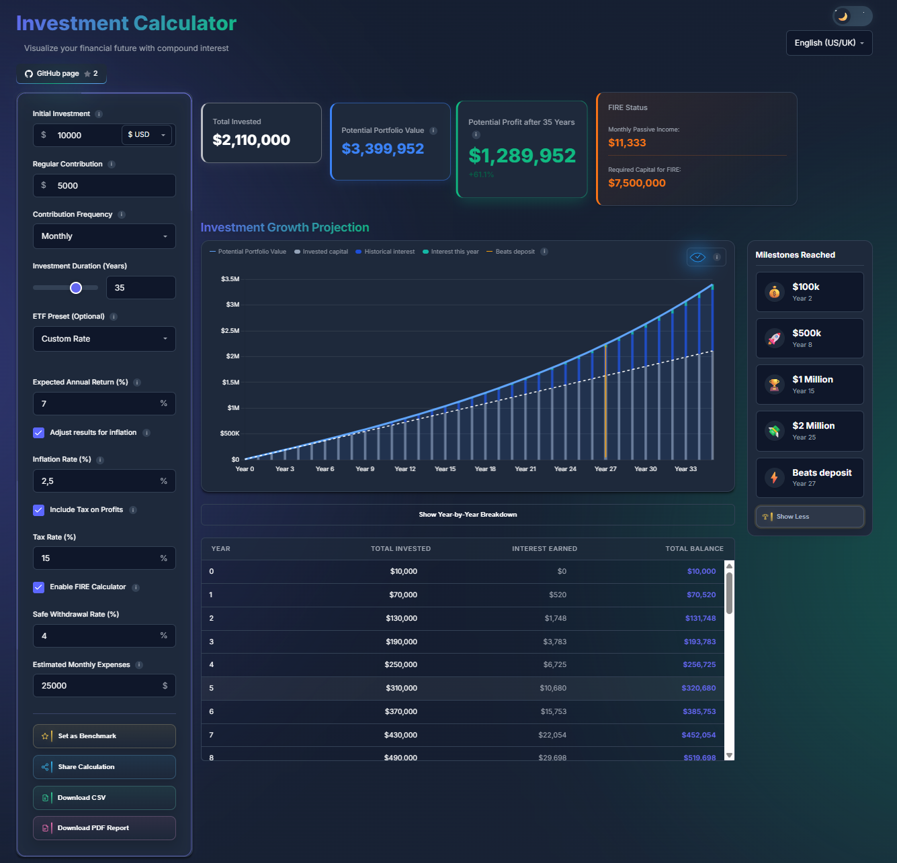
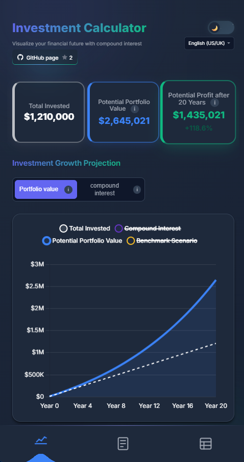

# Investment-Calculator

A modern, minimalist investment calculator designed to project long-term portfolio growth without ads or tracking.

[**Live Demo**](https://investmentcalculator.pomerancee.workers.dev) | [**License**](#license)

## Preview
Desktop preview

Phone preview

---

### Why I built this
I was looking for a straightforward investment calculator, but most of the top results were either cluttered with aggressive ads, had outdated designs, or lacked essential features like inflation adjustment and tax estimates in a single view. 

I wanted to create a tool that is **fast**, **modern**, **beginner-friendly**, keeping the user's data local.

### Key Features
*   **Compound Interest Projection:** Visualize how portfolio grows over years.
*   **Inflation Adjustment:** Toggle between nominal and real values to see actual future purchasing power.
*   **Tax Estimates:** Basic options for capital gains or income tax to get a more realistic net result.
*   **Milestone Tracker:** Track milestone goals including the year when the portfolio potentially reaches a specific value.
*   **FIRE (Financial Independence, Retire Early) Calculator:** Estimate how much capital is needed to retire early based on user expenses and a safe withdrawal percentage.
*   **Year-by-year breakdown:** Show Total Invested, Interest Earned, and Total Balance each year.
*   **Privacy First:** All calculations are done locally in the user's browser. No data is sent to any server.
*   **Phone UI** Added mobile UI with bottom navigation and optimized layout for better usability on smaller devices.

### Additional Features
*  **Benchmark Tracker:** Compare the last used parameters with new ones.
*  **Share Button:** Generate a link containing the current parameters so results can be shared while keeping calculations local.
*  **CSV Download:** Export all parameters into a CSV file.
*  **PDF Export:** Download a PDF containing the graph and selected parameters.

### Tech Stack
*   **Frontend:** Vanilla HTML5, CSS3, and JavaScript (ES6+).
*   **Hosting:** Cloudflare Workers.
*   **Design:** Minimalist modern UI.

### How to use
1.  **Online:** Visit the [Live Demo](https://investmentcalculator.pomerancee.workers.dev).
2.  **Locally:** 
    *   Clone this repository: `git clone https://github.com/robinjiri/Investment-Calculator.git`
    *   Open `index.html` in your favorite browser.

## Contributing
Contributions, ideas, and improvements are welcome.
Feel free to open an issue or submit a pull request.

## License
This project is licensed under the **Creative Commons Attribution-NonCommercial-ShareAlike 4.0 International (CC BY-NC-SA 4.0)**. 
*See the [LICENSE](LICENSE.md) file for more details.*

---
*Created with 🍊 by Pomerancee / Robajzs*
